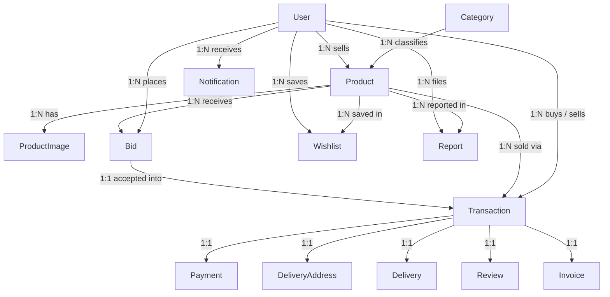

# Epsilon — Database Documentation

Database name: **`epsilon_db`**
Engine: **InnoDB** · Charset: **utf8mb4** · Normalized to **Third Normal Form (3NF)**

Everything described here is created by importing the single file
[`database.sql`](database.sql). See [`ER_DIAGRAM.md`](ER_DIAGRAM.md) for the diagram.

---

## Contents

1. [Object Summary](#object-summary)
2. [Table Reference](#table-reference)
3. [Relationship Diagram](#relationship-diagram)
4. [Relationship Reference](#relationship-reference)
5. [Views](#views)
6. [Stored Procedures](#stored-procedures)
7. [Triggers](#triggers)
8. [Indexes](#indexes)
9. [Normalization Explained](#normalization-explained)
10. [SQL Features Used](#sql-features-used)

---

## Object Summary

| Object | Count |
|---|---|
| Tables | 14 |
| Views | 2 |
| Stored Procedures | 4 |
| Triggers | 4 |
| Foreign Keys | 23 |
| Indexes | 43 |

---

## Table Reference

### 1. `User`
Every student. One account acts as both buyer and seller.

| Column | Type | Constraints |
|---|---|---|
| `user_id` | INT | **PK**, AUTO_INCREMENT |
| `student_id` | VARCHAR(20) | NOT NULL, **UNIQUE** |
| `full_name` | VARCHAR(100) | NOT NULL |
| `department` | VARCHAR(100) | NOT NULL |
| `batch` | VARCHAR(20) | NOT NULL |
| `email` | VARCHAR(100) | NOT NULL, **UNIQUE** |
| `phone` | VARCHAR(20) | NOT NULL |
| `password` | VARCHAR(255) | NOT NULL (bcrypt hash) |
| `role` | ENUM | `student`, `admin` — default `student` |
| `status` | ENUM | `active`, `banned` — default `active` |
| `created_at` | TIMESTAMP | default `CURRENT_TIMESTAMP` |

`student_id` and `email` are both unique, so one person cannot register twice.
A `banned` account is refused at login.

---

### 2. `Category`
The list of product categories.

| Column | Type | Constraints |
|---|---|---|
| `category_id` | INT | **PK**, AUTO_INCREMENT |
| `category_name` | VARCHAR(50) | NOT NULL, **UNIQUE** |

Seeded with: Books, Laptop, Phone, Calculator, Accessories, Others.

Rows can also be created by a student choosing **"+ Add a new category"** while
posting a product, and by the admin from the category manager. Because
`category_name` is `UNIQUE` and the column collation (`utf8mb4_unicode_ci`) is
case-insensitive, `books` and `Books` are treated as the same category — the
application looks the name up first and reuses the existing row rather than
attempting a duplicate insert.

---

### 3. `Product`
A listing posted by a student.

| Column | Type | Constraints |
|---|---|---|
| `product_id` | INT | **PK**, AUTO_INCREMENT |
| `seller_id` | INT | **FK** → `User(user_id)` ON DELETE CASCADE |
| `category_id` | INT | **FK** → `Category(category_id)` ON DELETE RESTRICT |
| `title` | VARCHAR(150) | NOT NULL |
| `description` | TEXT | NOT NULL |
| `price` | DECIMAL(10,2) | NOT NULL, `CHECK (price >= 0)` |
| `condition` | ENUM | `New`, `Like New`, `Good`, `Fair`, `Poor` |
| `status` | ENUM | `Available`, `Pending`, `Sold` — default `Available` |
| `created_at` | TIMESTAMP | default `CURRENT_TIMESTAMP` |
| `updated_at` | TIMESTAMP | auto-updates on change |

`ON DELETE RESTRICT` on the category stops a category being deleted while products
still use it. Deleting a user removes their listings.

---

### 4. `ProductImage`
Multiple photos per product (this is what keeps `Product` in 1NF).

| Column | Type | Constraints |
|---|---|---|
| `image_id` | INT | **PK**, AUTO_INCREMENT |
| `product_id` | INT | **FK** → `Product(product_id)` ON DELETE CASCADE |
| `image_path` | VARCHAR(255) | NOT NULL |
| `uploaded_at` | TIMESTAMP | default `CURRENT_TIMESTAMP` |

---

### 5. `Bid`
An offer from a buyer. Replaces the chat system.

| Column | Type | Constraints |
|---|---|---|
| `bid_id` | INT | **PK**, AUTO_INCREMENT |
| `product_id` | INT | **FK** → `Product(product_id)` ON DELETE CASCADE |
| `buyer_id` | INT | **FK** → `User(user_id)` ON DELETE CASCADE |
| `bid_amount` | DECIMAL(10,2) | NOT NULL, `CHECK (bid_amount > 0)` |
| `counter_amount` | DECIMAL(10,2) | NULL — the seller's counter offer |
| `status` | ENUM | `Pending`, `Countered`, `Accepted`, `Rejected` — default `Pending` |
| `created_at` | TIMESTAMP | default `CURRENT_TIMESTAMP` |

A bid moves `Pending → Countered` when the seller names a different price, and the
buyer then decides. **The agreed price is always
`COALESCE(counter_amount, bid_amount)`** — every query that needs the deal value
selects it that way and aliases it as `bid_amount`, so payment, delivery and the
invoice all pick up the counter price automatically.

---

### 6. `Transaction`
Created automatically the moment a seller accepts a bid.

| Column | Type | Constraints |
|---|---|---|
| `transaction_id` | INT | **PK**, AUTO_INCREMENT |
| `product_id` | INT | **FK** → `Product(product_id)` |
| `bid_id` | INT | **FK** → `Bid(bid_id)`, **UNIQUE** |
| `buyer_id` | INT | **FK** → `User(user_id)` |
| `seller_id` | INT | **FK** → `User(user_id)` |
| `transaction_date` | TIMESTAMP | default `CURRENT_TIMESTAMP` |
| `status` | ENUM | `Pending`, `Completed`, `Cancelled` |

`bid_id` is `UNIQUE`, guaranteeing one accepted bid can only ever produce one sale.

---

### 7. `Payment`
One payment per transaction.

| Column | Type | Constraints |
|---|---|---|
| `payment_id` | INT | **PK**, AUTO_INCREMENT |
| `transaction_id` | INT | **FK** → `Transaction`, **UNIQUE** |
| `payment_method` | ENUM | `bKash`, `Nagad`, `Rocket`, `Bank Transfer` |
| `amount` | DECIMAL(10,2) | NOT NULL |
| `payment_status` | ENUM | `Pending`, `Paid`, `Failed` — default `Pending` |
| `paid_at` | TIMESTAMP | NULL until paid |
| `created_at` | TIMESTAMP | default `CURRENT_TIMESTAMP` |

The `UNIQUE` transaction id makes double payment impossible at the database level.

---

### 8. `DeliveryAddress`
Where the buyer wants the item sent.

| Column | Type | Constraints |
|---|---|---|
| `address_id` | INT | **PK**, AUTO_INCREMENT |
| `transaction_id` | INT | **FK** → `Transaction`, **UNIQUE** |
| `receiver_name` | VARCHAR(100) | NOT NULL |
| `phone` | VARCHAR(20) | NOT NULL |
| `district` | VARCHAR(100) | NOT NULL |
| `area` | VARCHAR(100) | NOT NULL |
| `full_address` | TEXT | NOT NULL |

---

### 9. `Delivery`
Shipment progress and tracking.

| Column | Type | Constraints |
|---|---|---|
| `delivery_id` | INT | **PK**, AUTO_INCREMENT |
| `transaction_id` | INT | **FK** → `Transaction`, **UNIQUE** |
| `tracking_number` | VARCHAR(50) | NULL, **UNIQUE** |
| `delivery_status` | ENUM | `Pending`, `Packed`, `Shipped`, `Delivered` |
| `updated_at` | TIMESTAMP | auto-updates on change |

---

### 10. `Wishlist`
Junction table resolving the many-to-many between users and products.

| Column | Type | Constraints |
|---|---|---|
| `wishlist_id` | INT | **PK**, AUTO_INCREMENT |
| `user_id` | INT | **FK** → `User(user_id)` ON DELETE CASCADE |
| `product_id` | INT | **FK** → `Product(product_id)` ON DELETE CASCADE |
| `created_at` | TIMESTAMP | default `CURRENT_TIMESTAMP` |

`UNIQUE (user_id, product_id)` prevents saving the same product twice.

---

### 11. `Review`
The buyer's rating of the seller after delivery.

| Column | Type | Constraints |
|---|---|---|
| `review_id` | INT | **PK**, AUTO_INCREMENT |
| `transaction_id` | INT | **FK** → `Transaction`, **UNIQUE** |
| `buyer_id` | INT | **FK** → `User(user_id)` |
| `seller_id` | INT | **FK** → `User(user_id)` |
| `rating` | TINYINT | NOT NULL, `CHECK (rating BETWEEN 1 AND 5)` |
| `comment` | TEXT | NULL |
| `created_at` | TIMESTAMP | default `CURRENT_TIMESTAMP` |

---

### 12. `Report`
A flagged listing awaiting admin moderation.

| Column | Type | Constraints |
|---|---|---|
| `report_id` | INT | **PK**, AUTO_INCREMENT |
| `product_id` | INT | **FK** → `Product(product_id)` ON DELETE CASCADE |
| `reported_by` | INT | **FK** → `User(user_id)` ON DELETE CASCADE |
| `reason` | ENUM | `Fake Product`, `Spam`, `Scam`, `Wrong Information`, `Other` |
| `description` | TEXT | NULL |
| `status` | ENUM | `Pending`, `Reviewed`, `Resolved`, `Dismissed` |
| `created_at` | TIMESTAMP | default `CURRENT_TIMESTAMP` |

---

### 13. `Notification`
In-app alerts, all created by triggers.

| Column | Type | Constraints |
|---|---|---|
| `notification_id` | INT | **PK**, AUTO_INCREMENT |
| `user_id` | INT | **FK** → `User(user_id)` ON DELETE CASCADE |
| `type` | ENUM | `New Bid`, `Counter Offer`, `Bid Accepted`, `Bid Rejected`, `Payment Successful`, `Delivery Update` |
| `product_id` | INT | NULL, **FK** → `Product(product_id)` ON DELETE SET NULL |
| `transaction_id` | INT | NULL, **FK** → `Transaction(transaction_id)` ON DELETE SET NULL |
| `message` | VARCHAR(255) | NOT NULL |
| `is_read` | TINYINT(1) | default `0` |
| `created_at` | TIMESTAMP | default `CURRENT_TIMESTAMP` |

`product_id` and `transaction_id` record what the notification is about, which is what
makes each one clickable — bid notifications open the product's bid section and
payment/delivery ones open the transaction. Exactly one of the two is filled in.
`ON DELETE SET NULL` (rather than CASCADE) means the message survives if the product
is later removed; it simply stops being a link.

---

### 14. `Invoice`
Generated automatically when a payment succeeds.

| Column | Type | Constraints |
|---|---|---|
| `invoice_id` | INT | **PK**, AUTO_INCREMENT |
| `invoice_number` | VARCHAR(30) | NOT NULL, **UNIQUE** |
| `transaction_id` | INT | **FK** → `Transaction`, **UNIQUE** |
| `total_amount` | DECIMAL(10,2) | NOT NULL |
| `generated_at` | TIMESTAMP | default `CURRENT_TIMESTAMP` |

Invoice numbers look like `INV-20260804-00001`.

---

## Relationship Diagram



---

## Relationship Reference

| From | To | Type | Meaning |
|---|---|---|---|
| User | Product | 1 : N | A student lists many products |
| Category | Product | 1 : N | Each product has exactly one category |
| Product | ProductImage | 1 : N | Multiple photos per listing |
| Product | Bid | 1 : N | Many students bid on one product |
| User | Bid | 1 : N | A student places many bids |
| Bid | Transaction | 1 : 1 | Only the accepted bid becomes a sale |
| Product | Transaction | 1 : N | Historical sales of a product |
| User | Transaction | 1 : N | As buyer and as seller |
| Transaction | Payment | 1 : 1 | One payment per order |
| Transaction | DeliveryAddress | 1 : 1 | One shipping address per order |
| Transaction | Delivery | 1 : 1 | One shipment record per order |
| Transaction | Review | 1 : 1 | One review per completed order |
| Transaction | Invoice | 1 : 1 | Auto-generated on payment |
| User ↔ Product | Wishlist | M : N | Resolved by the `Wishlist` table |
| User | Report | 1 : N | A student reports many listings |
| Product | Report | 1 : N | A listing can be reported by many |
| User | Notification | 1 : N | System events per user |

---

## Views

### `vw_product_feed`
Joins a product with its category and seller, and adds three derived values via
subqueries: the primary image, the live seller rating, and the bid count.
Used by the home feed, search results, wishlist and My Products.

```sql
SELECT * FROM vw_product_feed WHERE status = 'Available' ORDER BY created_at DESC;
```

### `vw_seller_rating`
Average rating and total review count per seller, grouped from the `Review` table.

```sql
SELECT * FROM vw_seller_rating WHERE seller_id = 2;
```

---

## Stored Procedures

### `sp_place_bid(product_id, buyer_id, amount)`
Validates before inserting and raises a clear error when:
- the product does not exist,
- the product is not `Available`,
- the seller is trying to bid on their own product.

### `sp_counter_bid(bid_id, amount)`
The seller answers a bid with their own price instead of simply accepting or
rejecting it. Stores the figure in `counter_amount` and moves the bid to
`Countered`, which hands the decision back to the buyer. Only a `Pending` bid can
be countered, so a price cannot be haggled back and forth indefinitely.

### `sp_accept_bid(bid_id)`
The most important procedure in the project. Used by the seller to take the original
bid **and** by the buyer to take a counter offer. Runs inside `START TRANSACTION`
with an `EXIT HANDLER` that rolls back on any error, and performs all four steps
atomically:

1. Marks the chosen bid `Accepted`
2. **Rejects every other open bid on that product** (`Pending` or `Countered`)
3. Sets the product status to `Pending`
4. **Creates the `Transaction` record**

### `sp_reject_bid(bid_id)`
Closes a bid. Used by the seller to turn a bid down and by the buyer to decline a
counter offer, so it accepts both `Pending` and `Countered` bids.

---

## Triggers

### `trg_bid_after_insert` (AFTER INSERT ON Bid)
Notifies the seller: *"New bid of Tk 450.00 received on …"*

### `trg_bid_after_update` (AFTER UPDATE ON Bid)
Fires on every status change and tells the right person:

- `Countered` — the buyer is told the seller's new price
- `Accepted` — the buyer is told; if the deal came from a counter offer, the seller is told too
- `Rejected` — the buyer is told; if a counter offer was turned down, the seller is told too

This is also what makes the mass auto-rejection notify every losing bidder.

### `trg_payment_after_update` (AFTER UPDATE ON Payment)
Fires when `payment_status` becomes `Paid`. In one step it:
1. Sets the transaction to `Completed`
2. Sets the product to `Sold`
3. **Generates the invoice** with a formatted invoice number
4. Notifies both the buyer and the seller

### `trg_delivery_after_update` (AFTER UPDATE ON Delivery)
Notifies the buyer whenever the delivery status changes.

> Because invoices and notifications are produced by triggers rather than PHP, they
> are guaranteed to exist no matter how the underlying row was changed.

---

## Indexes

Beyond the automatic primary-key and unique indexes, these were added with
`ALTER TABLE` for the columns that are filtered and joined most often:

| Table | Index | Purpose |
|---|---|---|
| Product | `idx_product_status` | Feed shows only `Available` |
| Product | `idx_product_category` | Category filtering |
| Product | `idx_product_seller` | "My Products" lookups |
| Product | `idx_product_price` | Price range filtering and sorting |
| Bid | `idx_bid_product` | Listing bids on a product |
| Bid | `idx_bid_buyer` | "My Bids" lookups |
| Notification | `idx_notification_user` | Unread badge count (`user_id`, `is_read`) |
| Report | `idx_report_status` | Admin moderation queue |

---

## Normalization Explained

**First Normal Form (1NF)** — every column holds a single atomic value. Product photos
are rows in `ProductImage` rather than a comma-separated list, and the delivery address
is split into receiver, phone, district, area and street.

**Second Normal Form (2NF)** — every table uses a single-column surrogate primary key
(`*_id`), so no non-key column can depend on only part of a composite key.

**Third Normal Form (3NF)** — no non-key column depends on another non-key column:

- Seller rating is **not** stored on `Product` or `User`. It is calculated from
  `Review` through `vw_seller_rating`, so it can never disagree with the reviews.
- The category name lives only in `Category`; `Product` stores just `category_id`.
- The invoice total is stored on `Invoice` deliberately — it is a historical financial
  record that must stay fixed even if a price is edited later.

---

## SQL Features Used

| Feature | Where it is used |
|---|---|
| `CREATE DATABASE` / `USE` | Top of `database.sql` |
| `CREATE TABLE` | All 14 tables |
| `ALTER TABLE` | Adding the performance indexes |
| `INSERT` | Seed data, and every create action in the app |
| `UPDATE` | Bid status, payment, delivery, moderation |
| `DELETE` | Removing products, wishlist items, reports |
| `SELECT` / `WHERE` | Everywhere |
| `ORDER BY` | Feed sorting, search sorting |
| `GROUP BY` | Admin dashboard, payments by method |
| `HAVING` | Filtering grouped payment totals |
| `LIMIT` | Feed and search result caps |
| `LIKE` | Keyword search |
| Aggregate functions | `COUNT`, `SUM`, `AVG`, `ROUND`, `COALESCE` |
| `INNER JOIN` | Product ↔ Category ↔ User throughout |
| `LEFT JOIN` | Products with zero reports, transactions without payment yet |
| Subqueries | Primary image, seller rating and bid count in `vw_product_feed` |
| Views | `vw_product_feed`, `vw_seller_rating` |
| Stored Procedures | `sp_place_bid`, `sp_counter_bid`, `sp_accept_bid`, `sp_reject_bid` |
| Triggers | The four listed above |
| Transactions | `START TRANSACTION` / `COMMIT` / `ROLLBACK` in `sp_accept_bid` |
| Constraints | PK, FK, UNIQUE, NOT NULL, CHECK, ENUM, ON DELETE rules |
| Indexes | 43 across the schema |
