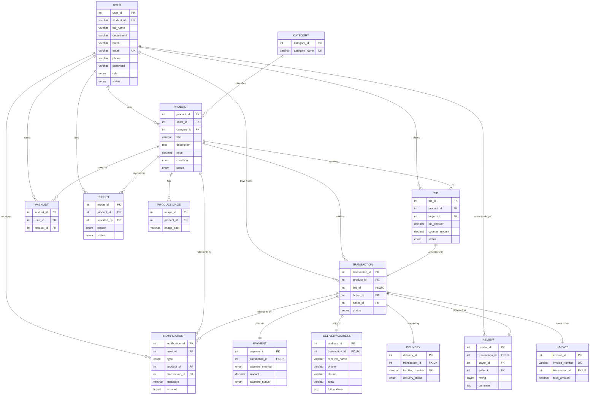

# Epsilon - Entity Relationship Diagram

This diagram reflects the schema created by [`database.sql`](database.sql), normalized to Third Normal Form (3NF).

> **For printing or submission, use [`ER_Diagram.pdf`](ER_Diagram.pdf)** — an 11-page
> landscape PDF in classic Chen notation: rectangles for entities, ellipses for
> attributes, diamonds for relationships, **primary keys with a solid underline**,
> **foreign keys with a dashed underline** in italic grey, and unique keys in a double
> ellipse. The last page lists all 23 foreign keys in one table. Regenerate it after
> any schema change with:
>
> ```
> C:\xampp\php\php.exe database\generate_erd.php
> ```
>
> The Mermaid diagram below is the same schema in a form that renders inside GitHub
> and most Markdown viewers.



## Relationship Summary

| Relationship | Type | Notes |
|---|---|---|
| User → Product | 1 : N | A student can list many products |
| Category → Product | 1 : N | Each product belongs to exactly one fixed category |
| Product → ProductImage | 1 : N | Multiple images per listing |
| Product → Bid | 1 : N | Many students can bid on one product |
| User → Bid | 1 : N | A student can place many bids (on other students' products) |
| Bid → Transaction | 1 : 1 | A transaction is created only from the single accepted bid |
| Transaction → Payment | 1 : 1 | One payment record per transaction |
| Transaction → DeliveryAddress | 1 : 1 | One shipping address per transaction |
| Transaction → Delivery | 1 : 1 | One shipment/tracking record per transaction |
| Transaction → Review | 1 : 1 | Buyer may leave one review per completed transaction |
| Transaction → Invoice | 1 : 1 | Auto-generated once payment succeeds |
| User ↔ Product (Wishlist) | M : N | Resolved by the `Wishlist` junction table |
| User → Report | 1 : N | A student can report multiple products |
| User → Notification | 1 : N | System-generated events per user |

## Why this is 3NF

- **1NF:** Every column holds a single atomic value (e.g. `ProductImage` is a separate table instead of a comma-separated column on `Product`).
- **2NF:** Every table uses a single-column surrogate primary key (`*_id`), so there are no partial dependencies on a composite key.
- **3NF:** No transitive dependencies — e.g. `seller_rating` is never stored on `Product`; it is derived on demand from `Review` via the `vw_seller_rating` view instead of being duplicated data that could go stale.
